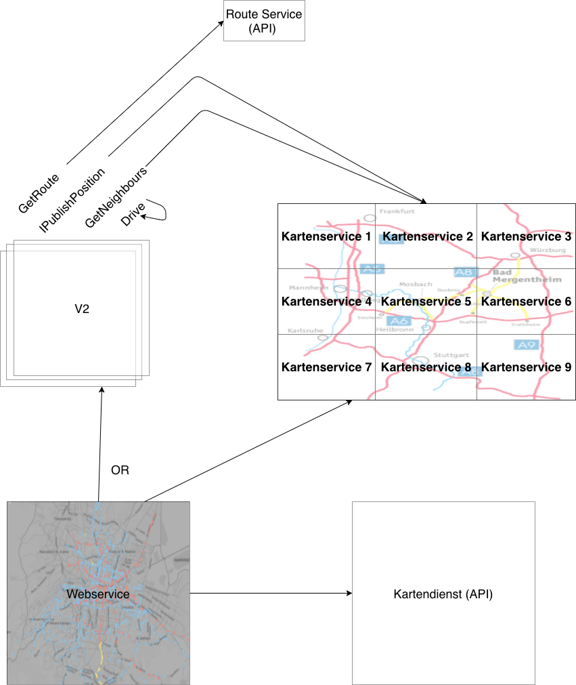

# TRASIMOS_Team3
Projektarbeit Verteilte Systeme

Verwendung unter Java 11 (Es wird gesagt manche Rebellen benutzen auch Java 1.8.201)

Übersicht der Systeme:

Prio 1:

V2              repräsentiert ein Fahrzeug

Routen          repräsentiert ein Routenservice (API CALL)

Infoservice     verwaltet ein Stück der Karte von Mosbach 
   
Radio           bietet in verschiedenen UDP Groups Informationen über die Services an.
                z.b. Wird auf Port XY die url der SOAP des Nameservices bekannt gegeben.          

Prio 2: 

WebServer       visualisiert die Positionen der Autos auf einer Karte 

Kartendienst    stellt ein realen Kartenauschnitt als Bild dar (ggf. Google api)

Prio 3: 

Name Service    Verwaltet alle Infoservices. Infoservices registrieren sich via SOAP bei NameService. Nameservice
                delegiert Infoservices bestimmte Kartenauschnitte zu verwalten. V2 Cars die neu spawnen bekommen die referenz
                zum richtigen Infoservice vom Nameservice. Danach verweisen die Infoservices auf den benachbarten Infoservice.
                

Aufbau der Architektur:

  

=================================

Beschreibung der Komponenten

# PRIO 1

# V2 

1. Auto besorgt sich Referenzen auf 
    -Webserver
    -Nameserver -> Informationsserver
    -Generieren von Start,Ziel
    -Route über API
    -Soap Schnittstelle anbieten für andere V2 (Interface : GetPosition (Id, Pos, Speed))
    
2. Regiestrieren

     -> Position an Informationsservice(inkl. URL der SOAP)
     -> Position an Webservice
     
2.  Auto begint routine (Bis am Ziel angekommen, Alles in Geodaten keine kmh /km )
    
    Alle 5 Iterationen:
    -> Get Neighbours durch Informationsserver
    
    -> Abfragen nahe Autos ? -> Bremsen ---- Bei 10kmh entsteht keine Kollission (Select * from Drivers where haircolor not like blond)
    
    -> Beschleundigen / Bremsen
    
    -> Bewegen
    
     -> Position an Informationsservice
     
     -> Position an Webservice
         

Methoden:

- IGetWebservice    : Eine Referenz auf den Webserivce wird über eine UDP Group geholt
- IGetNameService   : Eine Referenz auf den Nameservice wird über eine UDP Group geholt.
- IPublishPosition  : Übermittelt die eigene Position an den zuständigen Infoservice
- GetNeighbours     : Ermittelt über Anfragen am Kartenservice alle Autos in der Umgebung
                    => Weiter Kommunikation findet direkt unter den Autos statt, in der Gruppe aller direkten Nachbarn

optional:
- GetRoute          : Ermittelt die Route um von Startposition zu Zielposition zu gelangen

- Drive             : Besteht aus folgenden Routinen 

                    GetRoute
                    
                    Loop:
                        
                        - Position publishen -> an Informationsservice & Webserver
                        - Neighbours anfragen
                        - Position der Neighbours aktualisieren
                        - Geschwindigkeit anpassen
                        - Bewegen
                        - Kollsion überprüfen 
  
# Interface 
+ReceivePosition(Id, Richtung, Speed )   
                   
# Routen

Nutzen der API von :                        

http://141.72.191.30:5000/route/v1/driving/9.001,49.3;9.0,49.6?steps=true&alternatives=true&geometries=geojson

# Informationsservice

Der zu verwaltete Kartenbereich ca. 10km muss verteilt dargestellt werden, damit kein Bottleneck erzeugt wird.

Konzeptionierung:

Die Karte in gleich große Stücke aufteilen (Schachbrett). Jedes Feld stellt einen Service dar. Jeder Service kennt alle 8 umliegenden Felder.

Workflow:

0. Informationsservice besorgt sich vom Radio die url der SOAP vom Nameservice
1. Informationsservice registriert sich beim Nameservice und bekommt von Nameservice Kartenstück zugewiesen. Zudem 
    noch referenzen auf Umliegende Informationsservices.
2. Autos registrieren sich beim Informationsservice und nutzen Funktionen wie GetNeighbour.. falls getNeighbour 
    Autos von nächsten Informationsservice benötigt wird GetNeighbours(Posi,Radius) beim nächsten Informationsservice aufgerufen.
    Radius von getNeighbour hängt von Speed ab.

Funktionen:

- Verwalten der Positionen eines V2 Cars (durch Ipublish)
      Response -> OK, falls im verwalteten Kartenbereich
      Response -> Falls ein V2 den verawlteten Bereich verlässt soll die Referenz auf den nächsten Kartenservice übergeben werden.
        
- GetNeighbours liefern alle Autos in einem bestimmten Umkreis, ggf Anfragen bei anderen Kartenservices
      Ggf. geht Kommunikation vom Service aus -> Nur falls eine Änderung stattfindet
            
- GetCars liefert alle Positionen der verwalteten Autos zurück (ggf inkl. Himmelsrichtung) zur Visiualisierung im WebServer

# Interface
 +ReceivePos(Id,Posi)
 +GetNeighbours(Id,Speed)
 +Getneighbours(Posi,Radius)
 +OvertakeInformationservice(Pos,Pos,Pos,Pos) -> Übernehmen eines benachbarten NameService       
 +ReceiveFinished(Id)  
        
# Prio 2 
        
# WebServer       

Alle V2 Cars posten an die
visualisiert die Positionen der Autos auf einer Karte      

# Interface         
+ReceivePosition(Posi)

# Kartendienst

Der Tile Server kann unter der Adresse http://141.72.191.30/hot7{x}/{y}/{z}.png erreicht werden.
Hinweise Umrechnung von longitude and latitude in die Werte x,y und z finden Sie auch hier : https://wiki.openstreetmap.org/wiki/Slippy_map_tilenames#Lon..2Flat._to_tile_numbers_2
                        
                  
# Prio 3

                        
# Name Service    

1. Wieso Prio 3 ? -> Es wird davon ausgegangen, dass die Autos initial durch eine Factory erzeugt werden, die schon alle Kartenservices kennt.
                     der Kartenservices wäre somit ein Upgrade.

Benötigt um zwischen Position eines nachträglich gespawnetem Autos auf ein Informationsservice zu vernetzen ggf. Auch bei einem Ausfall eines Kartenservices.

# Interface

+GetInformationService(Posi)