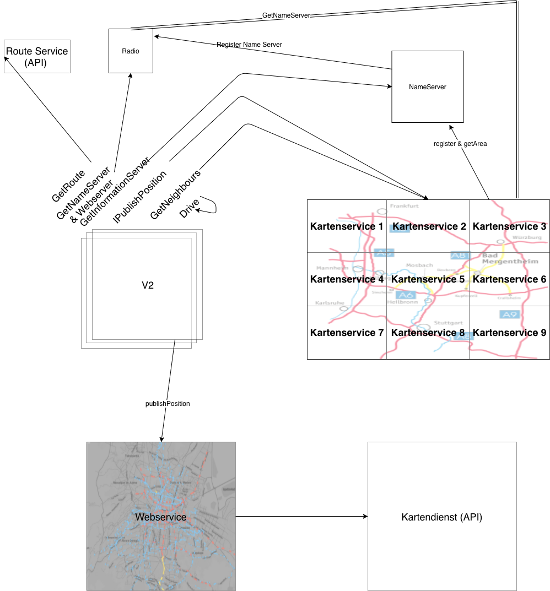

# TRASIMOS_Team3
Projektarbeit Verteilte Systeme

Verwendung unter Java 11 (Es wird gesagt manche Rebellen benutzen auch Java 1.8.201)

Übersicht der Systeme:

Prio 1:

V2              repräsentiert ein Fahrzeug

Routen          repräsentiert ein Routenservice (Ggf. in V2 realisiert durch call von API)

Kartenservive   verwaltet ein Stück der Karte von Mosbach

Prio 2: 

WebServer       visualisiert die Positionen der Autos auf einer Karte 

Kartendienst    stellt ein realen Kartenauschnitt als Bild dar (ggf. Google api)

Prio 3: 

Name Service    Benötigt um zwischen Position eines nachträglich gespawnetem Autos auf ein Kartenservice
                zu vernetzen ggf. Auch bei einem Ausfall eines Kartenservices.
                

Aufbau der Architektur:

  

=================================

Beschreibung der Komponenten

# PRIO 1

# V2 

Methoden:

- IPublishPosition  : Übermittelt die eigene Position an den zuständigen Kartenservice
- GetNeighbours     : Ermittelt über Anfragen am Kartenservice alle Autos in der Umgebung
                    => Weiter Kommunikation findet direkt unter den Autos statt, in der Gruppe aller direkten Nachbarn

optional:
- GetRoute          : Ermittelt die Route um von Startposition zu Zielposition zu gelangen

- Drive             : Besteht aus folgenden Routinen 

                    GetRoute
                    
                    Loop:
                        - Position publishen
                        - Neighbours anfragen
                        - Position der Neighbours aktualisieren
                        - Geschwindigkeit anpassen
                        - Bewegen
                        - Kollsion überprüfen 
  
# Interface 
+ReceivePosition(Id, Richtung, Speed )   
                   
                        

# Routen

Nutzen der API von :                        

http://141.72.191.30:5000/route/v1/driving/9.001,49.3;9.0,49.6?steps=true&alternatives=true&geometries=geojson

# Informationsservice

Der zu verwaltete Kartenbereich ca. 10km muss verteilt dargestellt werden, damit kein Bottleneck erzeugt wird.

Konzeptionierung:

Die Karte in gleich große Stücke aufteilen (Schachbrett). Jedes Feld stellt einen Service dar. Jeder Service kennt alle 8 umliegenden Felder.

Funktionen:

- Verwalten der Positionen eines V2 Cars (durch Ipublish)
      Response -> OK, falls im verwalteten Kartenbereich
      Response -> Falls ein V2 den verawlteten Bereich verlässt soll die Referenz auf den nächsten Kartenservice übergeben werden.
        
- GetNeighbours liefern alle Autos in einem bestimmten Umkreis, ggf Anfragen bei anderen Kartenservices
      Ggf. geht Kommunikation vom Service aus -> Nur falls eine Änderung stattfindet
            
- GetCars liefert alle Positionen der verwalteten Autos zurück (ggf inkl. Himmelsrichtung) zur Visiualisierung im WebServer

# Interface
+ReceivePos(Id,Posi)
+GetNeighbours(Id,Speed)
+Getneighbours(Posi,Radius)
+OvertakeInformationservice(Pos,Pos,Pos,Pos) -> Übernehmen eines benachbarten NameService         
        
# Prio 2 
        
# WebServer       

visualisiert die Positionen der Autos auf einer Karte, fragt alle Kartenservices / oder V2 nach Positionen an         

# Interface         
+GetNameService(Posi)

# Kartendienst

Der Tile Server kann unter der Adresse http://141.72.191.30/hot7{x}/{y}/{z}.png erreicht werden.
Hinweise Umrechnung von longitude and latitude in die Werte x,y und z finden Sie auch hier : https://wiki.openstreetmap.org/wiki/Slippy_map_tilenames#Lon..2Flat._to_tile_numbers_2
                        
                  
# Prio 3

                        
# Name Service    

1. Wieso Prio 3 ? -> Es wird davon ausgegangen, dass die Autos initial durch eine Factory erzeugt werden, die schon alle Kartenservices kennt.
                     der Kartenservices wäre somit ein Upgrade.

Benötigt um zwischen Position eines nachträglich gespawnetem Autos auf ein Kartenservice zu vernetzen ggf. Auch bei einem Ausfall eines Kartenservices.

# Interface
+GetInformationService(Posi)